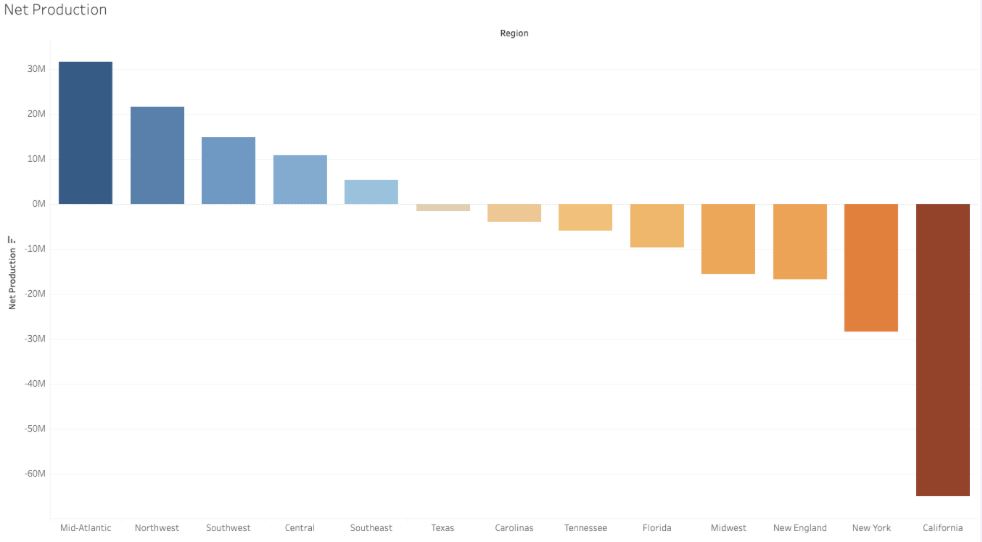
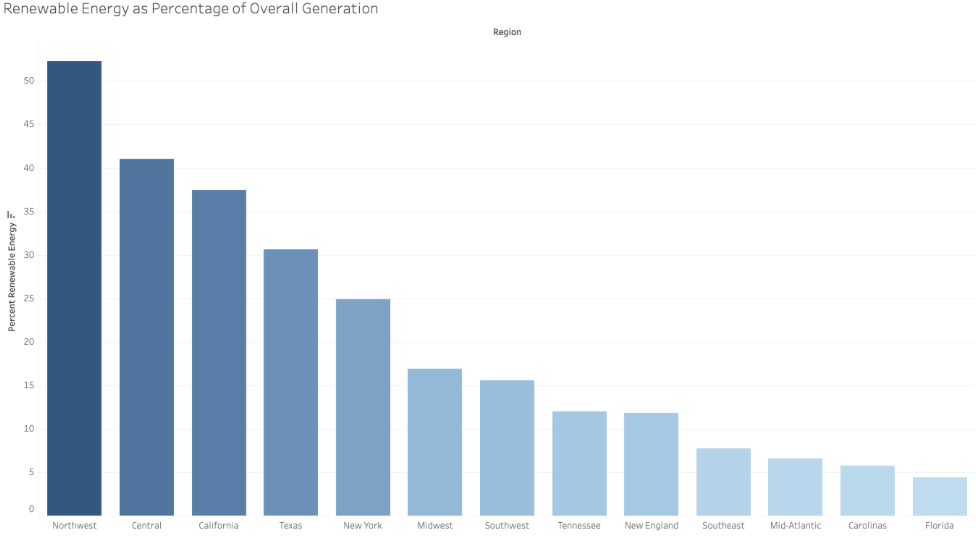
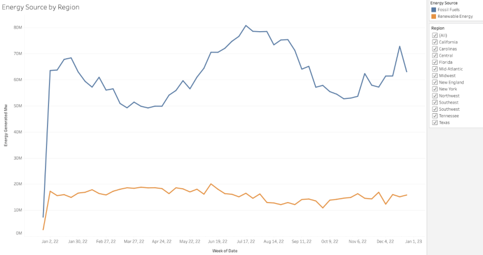
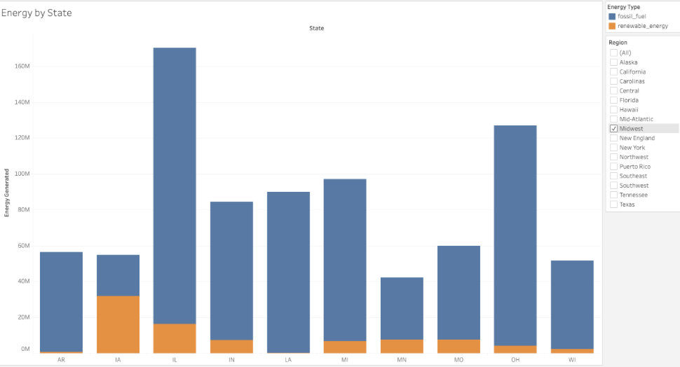

# Intel Energy Analysis Project

This project analyzes energy production, renewable energy trends, and power plant data across U.S. regions to provide insights for optimal data center site selection.

---

## SQL Analysis

You can view the SQL queries and results in the separate file: [Energy Analysis Queries](SQL-Analysis.md)

---

## Visualizations

### Net Production by Region

### Renewable Energy as Percentage of Overall Generation

### Energy Source by Region

### Energy by State

